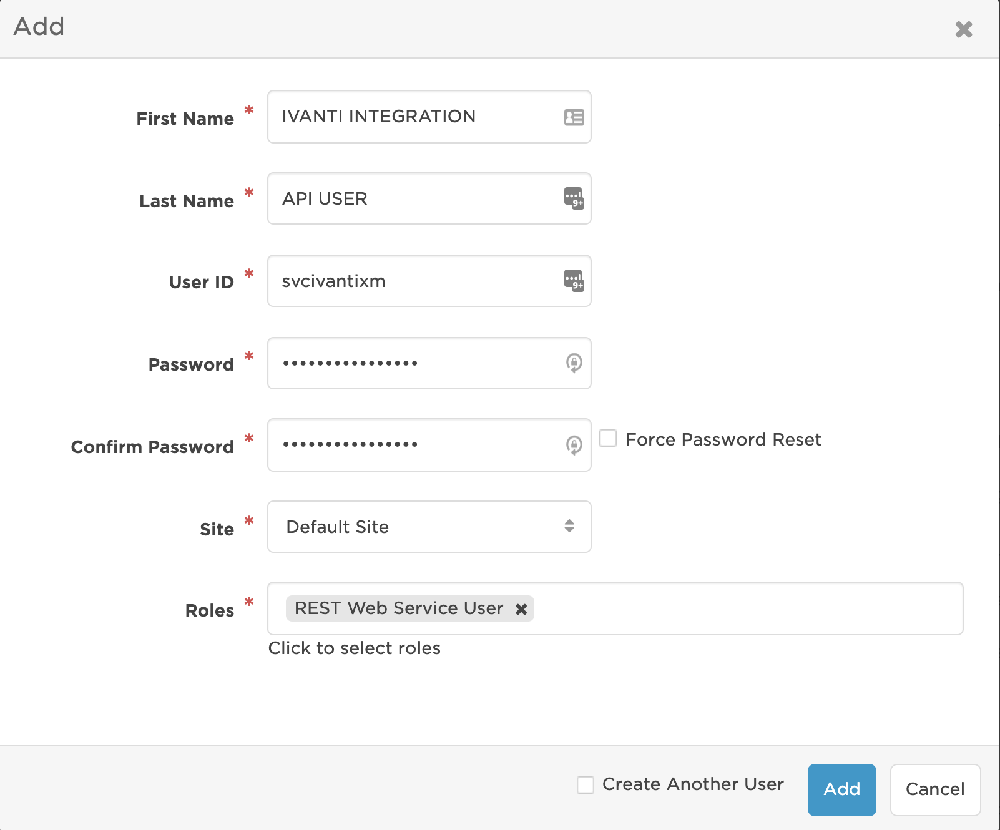
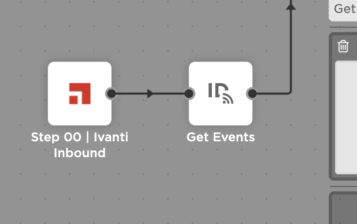
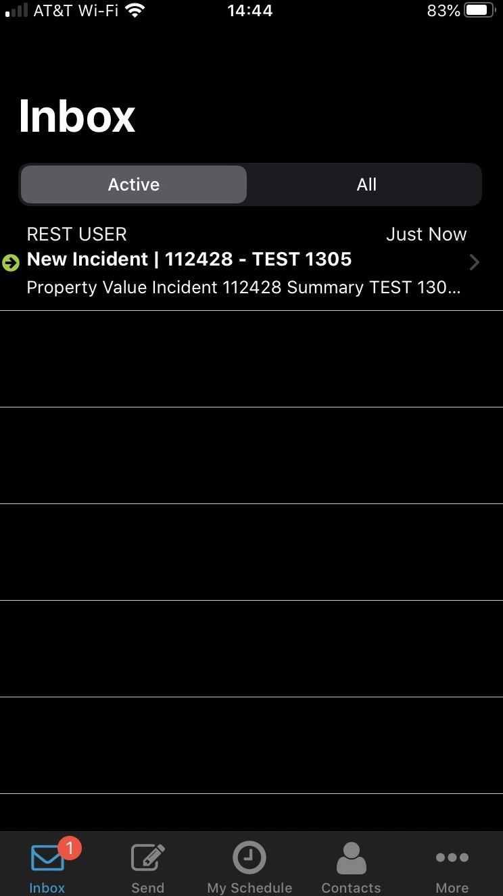
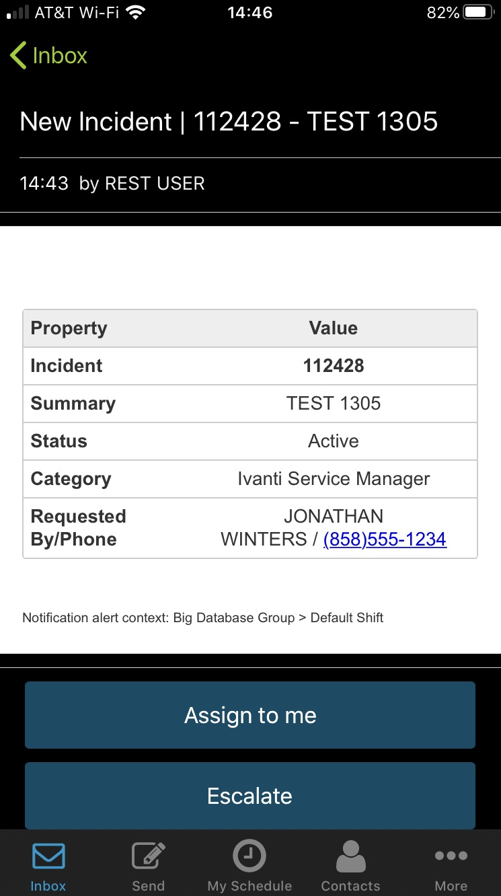

# Ivanti Service Manager Cloud Flow Designer Integration
Notify on-call response teams when critical incidents are reported in Ivanti Service Manager. With the xMatters and Ivanti Service Manager Cloud closed-loop integration, the on-call members of resolver teams are automatically notified via multiple communication channels. When the recipient responds, notes are added to the incident notes and specific incident actions may take place depending on the response.
<kbd>
  <a href="https://support.xmatters.com/hc/en-us/community/topics"></a>
</kbd>

# Pre-Requisites
* Cloud version of Ivanti Service Manager
* Account in Ivanti Service Manager
* xMatters account - If you don't have one, [get one](https://www.xmatters.com)!

# Files
* [IvantiServiceManager10.zip](IvantiServiceManager10.zip) - download this xMatters Workflow to get started

# How it works
A Quick Action or Trigger Rule configured in Ivanti triggers the Ivanti Web Connection to fire a REST API call to the inbound HTTP trigger in the imported xMatters Workflow (Ivanti Service Manager | 1.0). The Flow Designer steps parse the payload, build an event, and then create an xMatters Event targeted to the Ivanti Incident Owner Team. 

# Installation

## xMatters set up
### Create a REST integration user account

<kbd>
  
</kbd>

### Import the Workflow
Import the Ivanti Service Manager | 1.0 Workflow
https://help.xmatters.com/ondemand/xmodwelcome/workflows/manage-workflows.htm

### Assign permissions to the Workflow and Form  
* On the *Workflows* page, click the Edit drop-down menu for the **Ivanti Service Manager | 1.0** then select **Editor Permissions**
* Add any users, groups and/or roles to have editor permissions to this workflow
* On the *Workflows* page, click the **Ivanti Service Manager | 1.0** then click **FORMS**
* Click the **Web Service** drop-down menu for the **Incident** form
* Select **Sender Permissions** then add the xMatters REST integration user

### Configure Endpoints and Constants  
* On the *Workflows* page, click the **Ivanti Service Manager | 1.0** then click **FLOWS**
* Click **Incident**
* Click the **Components** drop-down button in the upper right then select **Endpoints**
* For the Ivanti endpoint, type the **Base URL** for the Ivanti environment, for example *https://customer.saasit.com* then **Save** then **Close**
* Click the **Components** drop-down button in the upper right then select **Constants**, and edit these constants:

| Constant                        | Description                                    |
|:------------------------------- |:---------------------------------------------- |
| Ivanti Session Password         | Password for Ivanti session key authentication |
| Ivanti Session Tenant           | Tenant for Ivanti session key authentication   |
| Ivanti Session Username         | Username for Ivanti session key authentication |
| Response Map                    | Response UUIDs                                 |
| XMATTERS_INCIDENT_EVENT_IB_PATH | Inbound Integration path (URL Auth) to Step 01 |

### Get the Response UUIDs  
* On the *Workflows* page, click the **Ivanti Service Manager | 1.0** then click **FORMS**
* Click the **Edit** drop-down for the Incident form then select **Responses**
* For each Response, click the **API** icon then in the Response Identifier pop-up window, copy the full UUID
* Paste the UUID in the Response Map constant for the corresponding Response
* Repeat the UUID copy and paste for each Response

### Get the XMATTERS_INCIDENT_EVENT_IB_PATH  
* On the *Workflows* page, click the **Ivanti Service Manager | 1.0** then click **INTEGRATION BUILDER**
* Click the **2 Configured** link for Inbound Integrations
* Click the **Step 01 | Ivanti Incident | Create Event** link
* Scroll to the **How to trigger the integration** section then click **Select method** and **URL Authentication** 
* In **Authenticating User** begin typing the username for the REST integration user in xMatters and select the user
* Click **Copy** to copy the URL displayed in *Trigger*
* Be sure to remove everything before `/api/integration/` after pasting in the Constant **XMATTERS_INCIDENT_EVENT_IB_PATH**

## Ivanti Service Manager set up
Configuring Ivanti Service Manager to integrate with xMatters requires the following steps:

* Create an API User
* Create a Web Connection
* Create Quick Action(s) and/or Trigger Rule(s)

### Create an API User
The integration requires an API user in Ivanti that is used by xMatters when retrieving a session key for REST API authorization.

### Create a Web Connection
As an Administrator, create an xMatters Incident Web Connection in Ivanti.

<kbd>
  
</kbd>

The standard Integration Script is:
```javascript
var url = 'xMatters Basic Auth Endpoint URL goes here';

var username = 'xMatters REST API username goes here';
var password = 'xMatters REST API password goes here';

var settings = {
    Headers: { 'Content-Type': 'application/json' },
    UserName : username,
    Password : password
};

var incidentData = { 

Category: "$(Category)",
IncidentID: "$(IncidentNumber)",
Owner: "$(Owner)",
OwnerTeam: "$(OwnerTeam)",
Phone: "$(Phone)",
RecId: "$(RecId)",
RequestedBy: "$(ProfileFullName)",
Status: "$(Status)",
Summary: "$(Subject)",
Type: "$(xMtrigger)"

};

var xMattersJSONString = JSON.stringify(incidentData);

var response = ExecuteWebRequest('POST', url, xMattersJSONString, settings);
```

Additional Ivanti properties can be added to both this Web Connection script and then also in xMatters. It is a best practice recommendation to name the property in xMatters the same as Ivanti, for example, above the Ivanti property `Category` is the same property configured in xMatters `Category`.

#### Get the xMatters Basic Auth Endpoint URL
* On the *Workflows* page, click the **Ivanti Service Manager | 1.0** then click **FLOWS**
* Click the **Incident** link
* Locate the **Step 00 | Ivanti Inbound** step then double-click it 

<kbd>
  
</kbd>  

* In the *INITIATION* section click **Basic**
* Click **Copy** to copy the URL displayed
* Paste the URL in the Web Connection script

#### About the xmTrigger
The script includes an `xmTrigger` custom property in Ivanti that is passed as `Type`. Type is used to refer to the use case that is triggering the alert to xMatters. See the Quick Action and Trigger section below for the most common use cases to configure and the recommended `xmTrigger` value.

### Create Quick Action(s) and/or Trigger Rule(s)
Create Quick Action(s) and/or Trigger Rule(s) specific to your use cases. These will call the xMatters Web Connection which will then alert xMatters to notify the Incident Owner Team. Below are suggested use cases where the use case name is also recommended as the value to use for `xmTrigger` in the Web Connection JSON payload.

| Use Case (xmTrigger) | Description                                                                                          |
|:-------------------- |:---------------------------------------------------------------------------------------------------- |
| New Incident         | trigger when a new Incident is created based on specific criteria, for example Priority is 1 or 2    |
| Reassigned           | trigger when an Incident is reassigned to a different Owner Team and the Incident Priority is 1 or 2 |
| Reopened             | trigger when an Incident is reopened and the Incident Priority is 1 or 2                             |
| Priority Upgrade     | trigger when an Incident Priority is upgraded from, for example, 3, 4 or 5 to 1 or 2                 |
| Priority Downgrade   | trigger when an Incident Priority is downgraded from, for example, 1 or 2 to 3, 4 or 5                |
| Resolved             | trigger when an Incident is resolved                                                                 |
| Closed                 | trigger when an Incident is closed                                                                   |
| Canceled               | trigger when an Incident is canceled                                                                 |

The use cases for **Priority Downgrade, Resolved, Closed, Canceled** are not used to create an xMatters Event but instead are used to terminate any ACTIVE events associated with that Incident in xMatters.

The criteria for the use cases, for example Priority is 1 or 2, will be based on your requirements. Priority level is typically the most common criteria.

## Triggering a notification
To trigger a notification, create and update incidents in Ivanti based on each of your use cases. For example, create a new Incident assigned to an Owner Team with a Priority of 1 or 2. The Ivanti Incident Owner Team must be a Group configured in xMatters.

## Responding to a notification
In the following example, the notification is received on an Apple iPhone, but the process is similar for all devices.  

* Notifications appear in the application Inbox  

<kbd>
  
</kbd>  

* Opening the notification displays the details  

<kbd>
  
</kbd>  

* After viewing the details, either click the respond (blue return arrow) icon at the top or scroll to the bottom of the notification

* Tap the desired response, then tap **Respond now** or **Respond with comment**  

# Troubleshooting
If an xMatters notification was not received, you can work backwards to determine where the issue may be:  
* Review the xMatters Reports tab and the specific [Event Log](https://help.xmatters.com/ondemand/installadmin/reporting/eventlogreport.htm)  
* If no Event was created, review the [xMatters Workflows Flow Designer Activity Panel](https://help.xmatters.com/ondemand/xmodwelcome/flowdesigner/activity-panel.htm)  
* If no activity was recorded, review the Ivanti logs for a POST to xMatters
